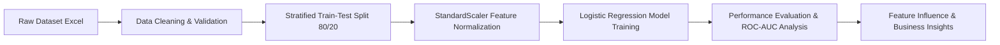

# Retail Return Risk Prediction & Analytics Report


## Executive Summary

The **Retail Return Risk Prediction** project aims to proactively identify high-risk retail orders prone to product returns. Customer returns impose substantial financial costs on e-commerce platforms, including reverse logistics fees, restock delays, and inventory depreciation. By modeling customer purchasing behaviors, transaction parameters, delivery lead times, and item categories, this machine learning framework provides actionable predictive scores to help retailers mitigate return risks before dispatch or implement targeted customer engagement strategies.

---

## Technical Stack & Dependencies

- **Programming Language:** Python 3
- **Data Manipulation & Analysis:** `pandas`, `numpy`
- **Machine Learning & Preprocessing:** `scikit-learn` (`StandardScaler`, `LogisticRegression`, `train_test_split`, `metrics`)
- **Data Visualization:** `matplotlib`, `seaborn`
- **Environment:** Jupyter Notebook / Google Colab

---

## Dataset Architecture & Exploratory Data Analysis

The dataset consists of **1,000 historical order records** across 7 key variables without missing or duplicated entries.

### Feature Dictionary

| Feature Name | Type | Description | Range / Distribution |
| :--- | :--- | :--- | :--- |
| `order_value` | Float | Total monetary value of the order ($) | $11.90 – $2,659.39 (Mean: $190.19) |
| `item_count` | Integer | Total number of items in the order | 0 – 9 items (Mean: 2.98) |
| `discount_pct` | Float | Discount percentage applied (%) | 0.00% – 100.00% (Mean: 50.43%) |
| `customer_return_rate` | Float | Historical return rate of the purchasing customer (%) | 0.00% – 100.00% (Mean: 50.75%) |
| `delivery_days` | Integer | Estimated / actual delivery lead time (Days) | 0 – 60 days (Mean: 29.71 days) |
| `category_risk` | Integer | Ordinal risk tier of product category (1 = Low, 5 = High) | 1 – 5 tier (Mean: 3.00) |
| **`target`** *(Target)* | Binary | Order return outcome (**1** = Returned, **0** = Kept) | 50% / 50% Balanced (500 per class) |

---

## Machine Learning Pipeline



1. **Preprocessing & Normalization:**
   - Evaluated data integrity: 0 null values, 0 duplicates.
   - Stratified train-test split: **800 training samples** (80%) and **200 testing samples** (20%).
   - Scaled features using `StandardScaler` to normalize feature distributions for optimal logistic regression performance.

2. **Model Training:**
   - Algorithm: `LogisticRegression(random_state=42)`
   - Convergence achieved cleanly with standard solver settings.

---

## Performance Evaluation & Benchmark Results

The baseline Logistic Regression classifier yielded strong initial predictive capabilities on the unseen test set (200 samples):

| Metric | Score | Performance Assessment |
| :--- | :--- | :--- |
| **Accuracy** | **0.6700** (67.00%) | Overall correct classification rate |
| **Precision** | **0.6545** (65.45%) | Correctness when predicting a return |
| **Recall** | **0.7200** (72.00%) | Ability to catch actual returned items |
| **F1-Score** | **0.6857** (68.57%) | Balanced harmonic mean of precision & recall |
| **ROC-AUC** | **0.7307** (73.07%) | Area under Receiver Operating Characteristic curve |

---

## Feature Influence & Drivers of Return Risk

Standardized model coefficients provide direct insights into key drivers influencing return probability:

```
delivery_days        [+0.6429]  ██████████████ (Highest Positive Risk Factor)
category_risk        [-0.6069]  ░░░░░░░░░░░░░░ (Negative Influence)
discount_pct         [+0.5303]  ███████████
order_value          [+0.4945]  ██████████
item_count           [-0.4312]  ░░░░░░░░░
customer_return_rate [-0.3455]  ░░░░░░░
```

### Key Business Takeaways
1. **Delivery Lead Time (`+0.6429`):** The strongest positive risk factor. Longer shipping times significantly elevate return likelihood, likely due to buyer remorse, delayed customer gratification, or missed deadlines.
2. **Discount Percentage (`+0.5303`):** High discount rates incentivize impulse purchasing, resulting in higher post-purchase return propensity.
3. **Order Value (`+0.4945`):** Higher monetary value orders experience higher return rates as customers examine expensive purchases more critically.

---

## Strategic Recommendations & Future Roadmap

1. **Advanced Model Ensembles:** Transition from baseline linear modeling to Tree-based Ensembles (`XGBoost`, `LightGBM`, `Random Forest`) to capture potential non-linear relationships.
2. **Decision Threshold Optimization:** Adjust the standard classification threshold (0.50) based on business cost-benefit matrices (balancing reverse logistics costs vs. customer friction).
3. **Logistics Optimization:** Prioritize expedited shipping for high-value orders to reduce delivery days below critical return risk windows.
4. **Feature Engineering:** Create interaction features (e.g., `discount_pct * order_value`) to capture compound purchase behavior metrics.

---

## Repository File Structure

```
retail/
├── dataset_10_retail_return_risk.csv.xlsx   # Primary dataset file
├── retail_return_risk.ipynb                 # Full end-to-end Jupyter Notebook pipeline
└── README.md                                # Comprehensive project documentation
```
